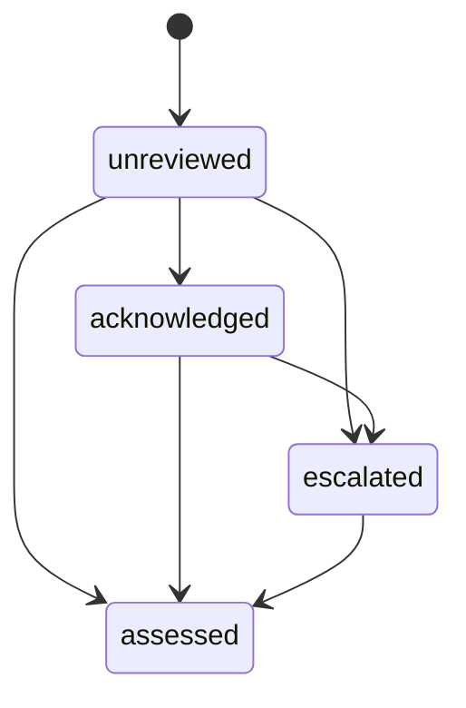

# Clinical safety finding review workflow

Stage 17 adds an append-only clinician-review timeline for each finding produced
by the deterministic safety-rule engine. It records that a clinician saw,
escalated or assessed a specific immutable evaluation snapshot. It does not
remove a finding, change the evaluation result, authorize treatment or provide
clinical clearance.

## Safety boundary

- Every write names the exact `evaluation_result_sha256` last read by the client.
  A mismatch returns conflict rather than attaching a review to an unexpected
  snapshot.
- Review events are append-only and hash-chained. Each event stores the finding's
  rule hash, the evaluation result hash, actor snapshot, prior event hash and a
  canonical SHA-256 over its versioned payload.
- An `acknowledged` event means only that an active physician or nurse recorded
  seeing the finding. An `escalated` event records referral for physician review.
- Only an active physician can record `assessed`. Its disposition is documented
  clinical judgment about that snapshot, not a mutation or dismissal of the
  rule-engine output.
- Every response states `changes_evaluation_result: false` and
  `is_clinical_clearance: false`. A new or corrected clinical context requires a
  new safety evaluation; an assessed event cannot be rewritten.
- Notes remain in the protected review payload. Audit events contain identifiers,
  hashes, action, disposition and reason code, not duplicated patient values or
  free-text notes.
- SHA-256 detects one-sided corruption. It is not a signature, external
  timestamp or defense against privileged SQL that rewrites content and hashes.

## State machine

`assessed` is terminal for that finding snapshot. Later facts, corrected reports
or a changed judgment are represented by a new safety evaluation, not by editing
history. The system intentionally has no `dismissed`, `cleared` or `overridden`
state.

An assessment requires a note, disposition and allowlisted reason code. Current
dispositions are `requires_action`, `not_applicable`, `action_documented` and
`monitoring`. They are documentation labels only and do not drive treatment
workflow transitions.

## Roles

| Action | Roles |
| --- | --- |
| Read review timelines/events and audit history | admin, physician, nurse |
| Record `acknowledged` or `escalated` | physician, nurse |
| Record `assessed` | physician only |

An administrative role cannot record a clinical review event. Rule governance
and patient-specific assessment remain separate: an independently approved rule
does not predetermine a physician's patient-specific disposition.

## API

All paths are below `/api/v1` and require authentication.

| Method and path | Purpose |
| --- | --- |
| `POST /visits/{visit_id}/safety-findings/{finding_id}/reviews` | Append one valid next review event and return the verified timeline |
| `GET /visits/{visit_id}/safety-findings/{finding_id}/reviews` | Read and integrity-check the full timeline |
| `GET /visits/{visit_id}/safety-findings/{finding_id}/audit-logs` | Read allowlisted workflow audit history |
| `GET /safety/finding-reviews/{review_id}` | Read one event after verifying its complete preceding hash chain |

The create operation shares the visit-level clinical-record lock used by intake,
reports and safety evaluations. PostgreSQL CI verifies a competing same-visit
writer receives the bounded lock conflict while unrelated visits remain governed
by their own parent locks. SQLite retains its database-writer serialization.

## Controlled deployment

1. Obtain clinical sign-off for workflow terminology, allowed dispositions,
   required notes, responsibility boundaries and escalation response times.
2. Drain old workers, take a verified backup and rehearse `alembic upgrade head`
   on a disposable restored copy. The expected head is `d51e7a9b2c64`.
3. Confirm the new `clinical_safety_finding_reviews` table is empty, run release
   preflight and deploy only the matching application/database pair.
4. In staging, verify nurse acknowledgment/escalation, physician-only assessment,
   invalid transition refusal, stale-hash conflict, tamper detection, audit
   minimization and same-visit concurrency using synthetic records.
5. Validate notification delivery, staffing, downtime procedures and the future
   clinician UI separately before clinical use.

Downgrade is refused while any review event exists and offline downgrade is
refused because history cannot be checked. Never delete review history to force
older code onto the database; restore the reviewed application/database pair.

## Explicitly deferred

- notification or paging delivery, deadlines and escalation-service monitoring;
- alert-fatigue analytics and clinically approved prioritization policy;
- override authority or any state that suppresses a finding;
- clinician-facing recommendation generation or treatment ranking;
- digital signatures, trusted timestamps and regulatory/device validation;
- automatic learning from review dispositions or patient outcomes.
