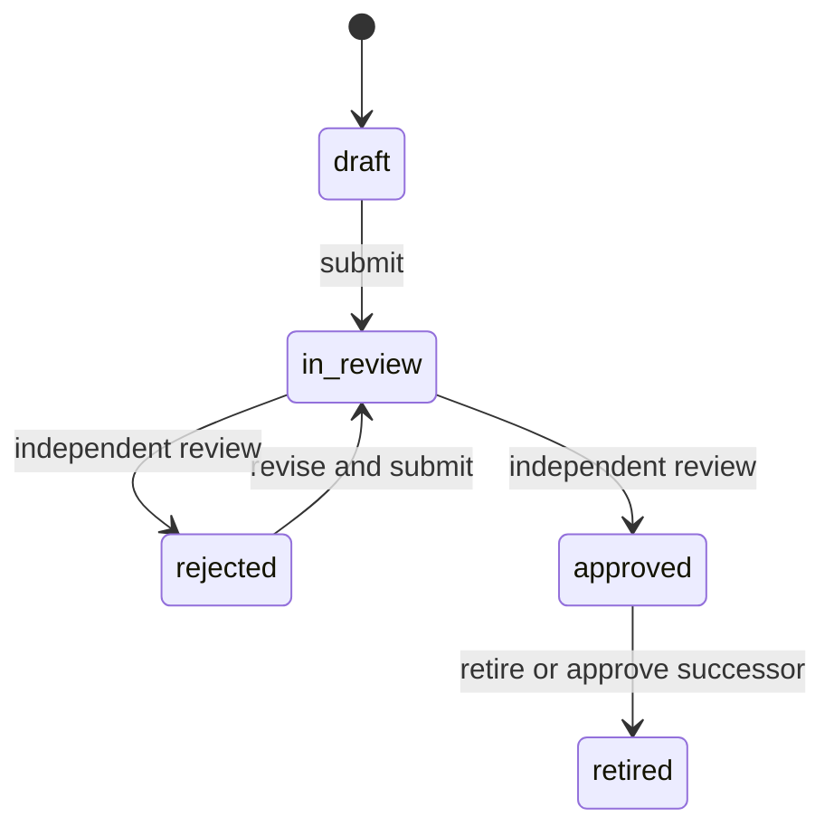

# Clinical safety rule engine

Stage 16 adds a governed, deterministic safety-rule layer over the approved
medical-knowledge registry and the current final clinical context. It can flag
explicitly configured conditions for clinician review. It does not diagnose,
prescribe, choose a treatment, estimate prognosis, or clear a patient for a
procedure.

## Safety boundary

- Only rules in `approved` state and inside their validity window are evaluated.
- Every rule references one or more approved, currently valid medical-knowledge
  facts. The rule stores each fact's content hash and fails closed if a linked
  fact is retired, expires, disappears, or no longer matches that snapshot.
- Only the current `final` clinical intake and paraclinical reports are consumed.
  Draft, superseded and entered-in-error records are excluded by the structured
  clinical-context service.
- The rule language is a bounded declarative schema. Unknown fields and
  operators are rejected; arbitrary expressions, scripts, queries, imports and
  function calls cannot be stored as predicates.
- Every evaluation is an append-only snapshot of the context hash, ordered rule
  set hash, triggered findings, evidence identifiers and per-condition trace.
  There is no update or delete endpoint.
- `no_alerts` means that no configured active rule matched the available current
  data. `no_active_rules` means that nothing was evaluated. Neither outcome is
  clinical clearance; every response states `is_clinical_clearance: false`.
- SHA-256 detects one-sided corruption. It is not a digital signature, external
  timestamp, clinical validation, or protection from privileged SQL that
  rewrites both content and its hash.

No rules or medical claims are seeded by this release. A clinical governance
group must author, source, test and independently approve each production rule.
Patient records never promote themselves into rules or general knowledge.

## Governed rule lifecycle

Admins and physicians may author rules. A different active admin or physician
must approve, reject or retire authored content. An approved rule cannot be
edited. A revision is a new version linked through `supersedes_rule_id`; its
approval retires the prior approved version in the same transaction.

## Declarative conditions

A predicate combines one through fifty conditions with `all` or `any`.

| Source | Supported data | Notes |
| --- | --- | --- |
| `intake` | pain score; selected text fields; clinical lists such as medications, allergies and red flags | Field names are allowlisted. |
| `observation` | quantity, integer, string, coded, interpretation, boolean or existence | `code_system` and `code` are required; `OTHER` also requires a URI. |

Operators are allowlisted by data type: equality/inequality, numeric ordering,
inclusive `between`, membership, text containment, list containment, presence,
absence, empty and non-empty checks. Quantity comparisons require an exact
`unit_code` match. The engine does not convert units or validate LOINC, SNOMED CT
or UCUM semantics; terminology validation remains a deployment prerequisite.

The trace intentionally records condition metadata and matched record IDs, not
a second copy of the patient's clinical values. Findings include the exact rule
version/hash and linked medical-knowledge fact IDs so the result can be reviewed
against the governed evidence.

## Roles

| Action | Roles |
| --- | --- |
| Read governed rules | admin, physician, nurse, operator, viewer |
| Create, edit, submit or supersede rules | admin, physician |
| Approve, reject or retire rules | admin, physician, with independent-review rule |
| Run an evaluation | admin, physician |
| Read evaluations | admin, physician, nurse |
| Read rule/evaluation audit history | admin, physician, nurse |

Finding acknowledgment, escalation and physician assessment are implemented by
the separate append-only workflow in
`docs/CLINICAL_SAFETY_REVIEW_WORKFLOW.md`. Those events never change an
evaluation result.

## API

All paths are below `/api/v1` and require authentication.

| Method and path | Purpose |
| --- | --- |
| `POST /safety/rules` | Create a source-linked version-1 draft |
| `GET /safety/rules` | Filter/list all governed lifecycle states |
| `GET /safety/rules/active` | List approved, currently valid rules |
| `GET /safety/rules/{id}` | Read and integrity-check one rule |
| `PUT /safety/rules/{id}` | Replace complete draft/rejected content |
| `POST /safety/rules/{id}/submit` | Submit for independent review |
| `POST /safety/rules/{id}/review` | Approve or reject an in-review rule |
| `POST /safety/rules/{id}/supersede` | Create a linked successor draft |
| `POST /safety/rules/{id}/retire` | Retire an approved rule |
| `GET /safety/rules/{id}/audit-logs` | Read rule lifecycle history |
| `POST /visits/{visit_id}/safety-evaluations` | Evaluate and append a snapshot |
| `GET /visits/{visit_id}/safety-evaluations` | List visit snapshots |
| `GET /visits/{visit_id}/safety-evaluations/latest` | Read the latest snapshot |
| `GET /visits/{visit_id}/safety-inbox` | Read the latest snapshot with verified finding-review timelines and context freshness |
| `GET /safety/evaluations/{id}` | Read and integrity-check a snapshot |
| `GET /safety/evaluations/{id}/audit-logs` | Read evaluation audit history |

The optional evaluation request can include the context and rule-set hashes last
seen by a client. A mismatch returns conflict instead of evaluating stale input.
Visit-scoped evaluation writes share the existing parent-row locking protocol.
The clinician-facing display and its explicit limitations are documented in
`docs/CLINICAL_SAFETY_INBOX.md`.

## Controlled deployment

1. Obtain documented clinical ownership for rule content, severity, action,
   wording, evidence, validity windows, review cadence and retirement criteria.
2. Drain old workers, create a verified backup and rehearse the upgrade on a
   disposable restored copy. The engine revision is `c92e4b7a1d30`; the current
   application head after the review-workflow and evidence-brief stages is
   `e6b7c8d9a401`.
3. Inspect the four engine tables and the empty finding-review table, then run
   release preflight. Deploy only the matching application build; never run a
   mixed-version fleet.
4. In staging, create rules from reviewed synthetic evidence and verify author /
   reviewer separation, unit mismatch behavior, missing data, supersession,
   expiry/retirement failure and append-only audit history.
5. Validate the intended PostgreSQL topology, clinician workflow, translations,
   terminology service, monitoring and incident response before clinical use.

Downgrade is refused while any safety rule, evidence link, evaluation or finding
exists. Never delete governed safety history to force a rollback; restore the
reviewed application/database pair through the controlled recovery process.

## Explicitly deferred

- clinician-facing recommendation generation or treatment ranking;
- override authority, escalation delivery and alert-fatigue policy (append-only
  acknowledgment/escalation recording is implemented separately);
- terminology-server validation, unit conversion and FHIR import/export;
- continuous publication ingestion or automatic rule creation;
- learning from patient outcomes, model training or autonomous knowledge updates;
- external signatures/timestamps and regulatory or medical-device validation.
