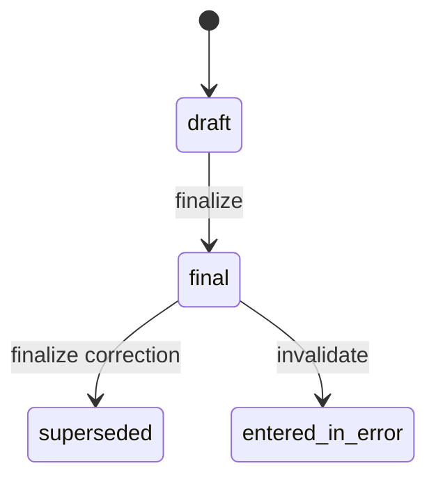

# Structured clinical context

Stage 15 adds the patient-specific, structured input layer consumed by the
separate safety-rule stage and needed before a future clinician-copilot stage. It records an initial clinical
intake and paraclinical reports; it does not diagnose, rank treatments, or
generate recommendations.

## Safety boundary

- Patient records remain patient records. No intake, result, outcome, note or
  audit event is copied into the medical-knowledge registry or treated as a
  generally applicable fact.
- The future decision-support consumer endpoint exposes only `final` records.
  Drafts, superseded versions and records entered in error are excluded.
- Final content has no update endpoint. A correction is a new draft linked to
  the exact final version it supersedes, with a required reason. The prior final
  remains current until the correction is itself finalized atomically.
- A current final record may instead be marked `entered_in_error`, with a
  required reason and actor/time attribution. It remains retained but disappears
  from current context.
- Canonical SHA-256 checks cover the structured clinical content, version and
  lineage. They detect one-sided corruption; they are not a signature, trusted
  timestamp or protection against privileged SQL that replaces both data and
  hash.
- Audit events contain identifiers, status, counts and hashes—not duplicated
  complaint, history, result values, medication or allergy text.

The observation shape is deliberately inspired by the
[HL7 FHIR R4 Observation resource](https://hl7.org/fhir/R4/observation.html),
but this API is not a FHIR implementation or certification. `LOINC`,
`SNOMED_CT`, `LOCAL` and `OTHER` identifiers, including a required system URI
for `OTHER`, and UCUM-style `unit_code` values are preserved as entered. This
release has no terminology server and therefore
does not verify that a submitted code, display or unit is semantically correct.
Reports group observations in a DiagnosticReport-like way, but do not claim
FHIR exchange compatibility.

## Records and lifecycle

Each visit has at most one clinical-intake lineage. A visit may have multiple
paraclinical report lineages, identified by a normalized `report_key`; each key
has ordered versions.

A superseding version is created as a draft. Finalizing it moves the previous
`final` version to `superseded` in the same visit-locked transaction. There are
no DELETE endpoints. Version and predecessor uniqueness constraints prevent
forked histories through normal writes.

If valid source documentation later becomes available, an `entered_in_error`
record can receive one replacement draft. Finalizing that replacement restores
the lineage's current context while the invalid version permanently retains its
`entered_in_error` status and reason.

Initial clinical intake captures complaint, history of present illness, body
region/laterality, onset date, pain score, functional limitations, relevant
history, medications, allergies, examination findings, red flags, clinical
impression and care goal. A first intake may be created/finalized only while the
visit is open. Corrections remain possible after closure.

Paraclinical reports capture category, title, identifiers/times, performer,
conclusion, source reference and ordered atomic observations. A late result may
be added to an open or completed visit, but not a cancelled visit. Supported
observation value types are `quantity`, `string`, `boolean`, `integer`, `coded`,
`datetime` and `absent`. API and database constraints require exactly the value
field that matches the declared type. Quantities require a unit (`1` for a
dimensionless UCUM value); numeric reference bounds are quantity-only.

## Roles

| Action | Roles |
| --- | --- |
| Read records/current context | admin, physician, nurse, operator, viewer |
| Create or replace drafts; create corrections | admin, physician, nurse, operator |
| Finalize or enter in error | admin, physician |
| Read per-record audit history | admin, physician, nurse |

The service rechecks the active actor after acquiring the visit write lock.
SQLite serializes writers; PostgreSQL requires `READ COMMITTED` and locks only
the parent visit row. Direct SQL and legacy services do not automatically join
this protocol.

## API

All paths are below `/api/v1` and require authentication.

| Method and path | Purpose |
| --- | --- |
| `POST /visits/{visit_id}/clinical-intakes` | Create the first intake draft |
| `GET /visits/{visit_id}/clinical-intakes` | List all intake versions |
| `GET /clinical-intakes/{id}` | Read and integrity-check one version |
| `PUT /clinical-intakes/{id}` | Replace the complete draft content |
| `POST /clinical-intakes/{id}/finalize` | Finalize a draft |
| `POST /clinical-intakes/{id}/supersede` | Create a correcting draft |
| `POST /clinical-intakes/{id}/entered-in-error` | Invalidate current final |
| `GET /clinical-intakes/{id}/audit-logs` | Read lifecycle audit history |
| `POST /visits/{visit_id}/paraclinical-reports` | Create report version 1 |
| `GET /visits/{visit_id}/paraclinical-reports` | List/filter report versions |
| `GET /paraclinical-reports/{id}` | Read report and atomic observations |
| `PUT /paraclinical-reports/{id}` | Replace a complete report draft |
| `POST /paraclinical-reports/{id}/finalize` | Finalize a report draft |
| `POST /paraclinical-reports/{id}/supersede` | Create a correcting report |
| `POST /paraclinical-reports/{id}/entered-in-error` | Invalidate current final |
| `GET /paraclinical-reports/{id}/audit-logs` | Read report audit history |
| `GET /visits/{visit_id}/clinical-context` | Read only current final context |

`PUT` intentionally replaces the whole draft. This prevents partial-update
ambiguity around clinically meaningful empty lists and nullable fields.

## Controlled deployment

1. Drain all older workers and make a verified backup using the existing
   recovery procedure.
2. Rehearse the migration on a disposable restored copy. The expected Alembic
   head after the safety-rule stage is `c92e4b7a1d30`.
3. Inspect the three new empty tables: `clinical_intakes`,
   `paraclinical_reports` and `paraclinical_observations`; existing visits are
   not backfilled or inferred.
4. Deploy only the matching application build and run release preflight.
5. Exercise author/finalizer separation, correction, entered-in-error and
   current-context behavior with synthetic staging data before clinical use.

Downgrade is refused while any of these tables contains data. Never delete
patient documentation to force a rollback; restore the reviewed application and
database pair through the controlled recovery process.

## Explicitly deferred

- terminology-server validation and FHIR import/export;
- file/object storage for original laboratory or imaging documents;
- clinician-facing advice with source citations and explainability;
- knowledge-surveillance proposals and independent approval workflow;
- outcome aggregation, de-identification, bias monitoring and approved learning.

Deterministic, governed safety flags are now implemented separately in
`docs/CLINICAL_SAFETY_RULE_ENGINE.md`. They do not provide diagnostic or
treatment advice and never interpret `no_alerts` as clinical clearance.
